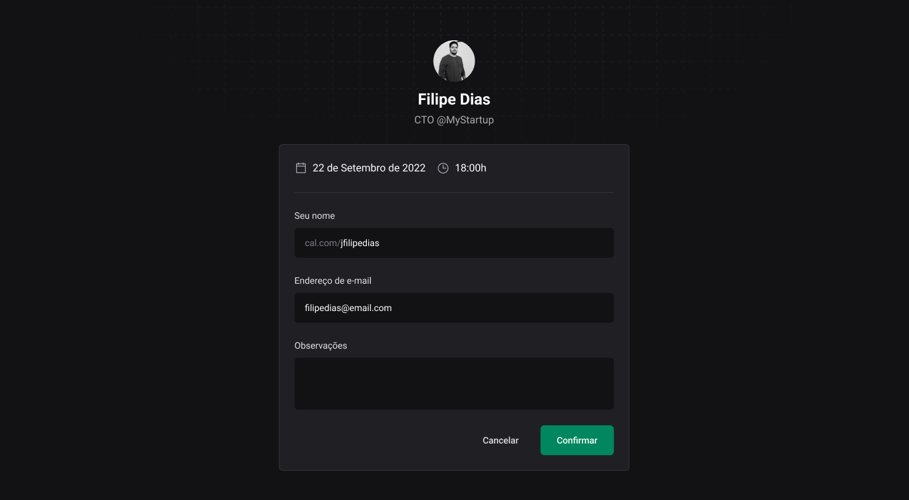

# Ignite UI

<p align="center">
  
  
</p>
<br>

O Ignite UI é uma implementação em [ReactJS](https://reactjs.org/) do design system desenvolvido para o projeto Ignite Call. Dessa forma, foi desenvolvido um monorepo composto por pacotes para tokens de ui, componentes em react, documentação dos componentes e tokens com [Storybook](https://storybook.js.org/) e configurações de lint e typescript. 

Para o gerenciamento do monorepo foram utilizados o [Turborepo](https://turbo.build/repo) para a build com cache e o [Changesets](https://github.com/changesets/changesets) para o versionamento dos pacotes.

Além disso, o projeto também conta com pipelines de CI/CD para deploy da documentação e publicação dos pacotes no [npm](https://.npmjs.com/).

A documentação com storybook pode ser acessada por esse [link](https://jfilipedias.github.io/ignite-ui/). Já os pacotes publicados no npm podem ser acessados nos seguintes links:

- [@ignite-ui-filipe/react](https://npmjs.com/package/@ignite-ui-filipe/react)
- [@ignite-ui-filipe/tokens](https://npmjs.com/package/@ignite-ui-filipe/tokens)

<div align="center">
  
</div>

## Getting Started

Uma vez que o pacote `docs` utiliza o `storybook v6.5` será necessário ter o [Node.js 16](https://nodejs.org/en/download/releases/)  e o [npm](https://npmjs.com/) instalados.

Instale as dependências do projeto:

```shell
npm i
```

Uma vez que o projeto utiliza o [Turborepo](https://turbo.build/repo) para sua pipeline de `dev` e `build`, basta executar o comando a seguir para iniciar os pacotes em ambiente de desenvolvimento:

```
npm run dev
```

Para gerar a build de cada pacote basta executar o comando:

```
npm run build
```

## Tecnologias

- [Changesets](https://github.com/changesets/changesets)
- [ESLint](https://eslint.org/)
- [Radix](https://radix-ui.com/)
- [ReactJS](https://reactjs.org/)
- [Stitches](https://stitches.dev/)
- [Storybook](https://storybook.js.org/)
- [Turborepo](https://turbo.build/repo)
- [Typescript](https://typescriptlang.org/)

## Licença

Este projeto está licenciado sob o MIT. Consulte a [licença](LICENSE) para mais informações.
